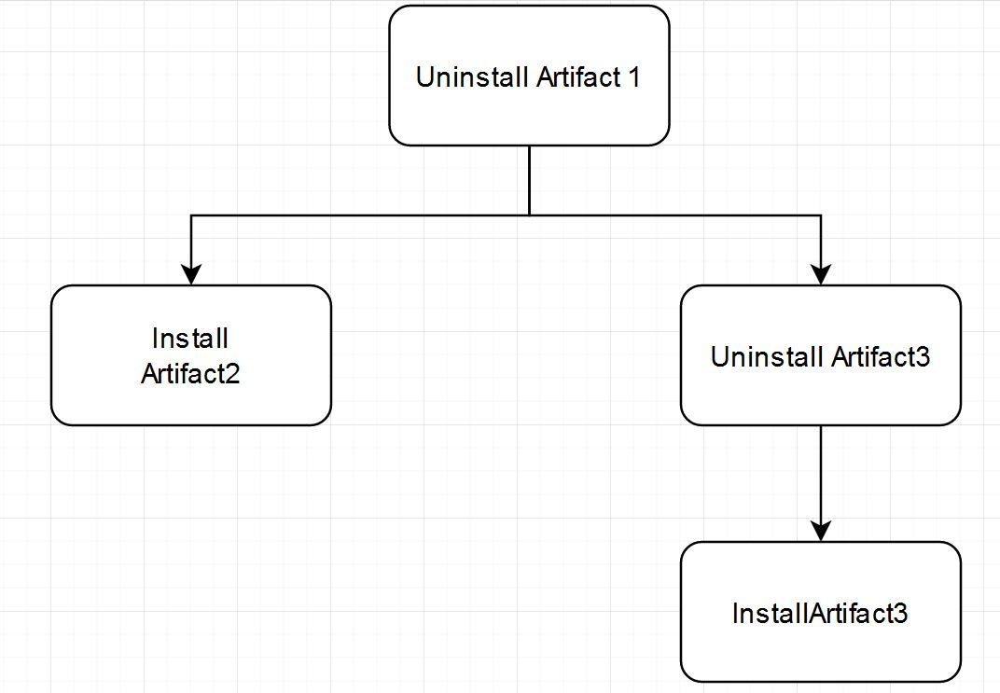
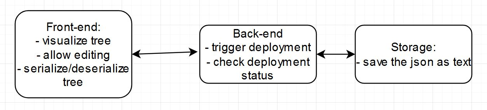
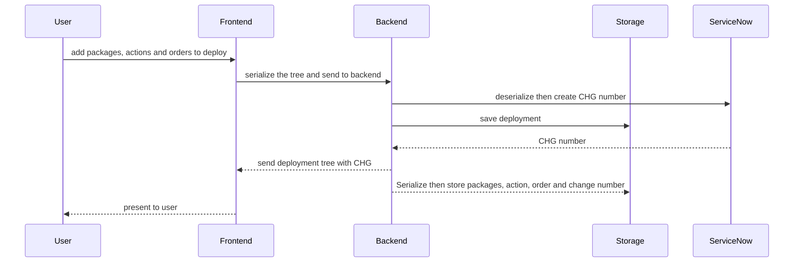
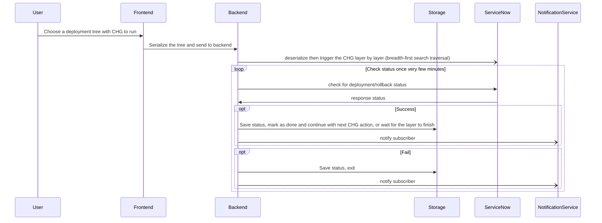
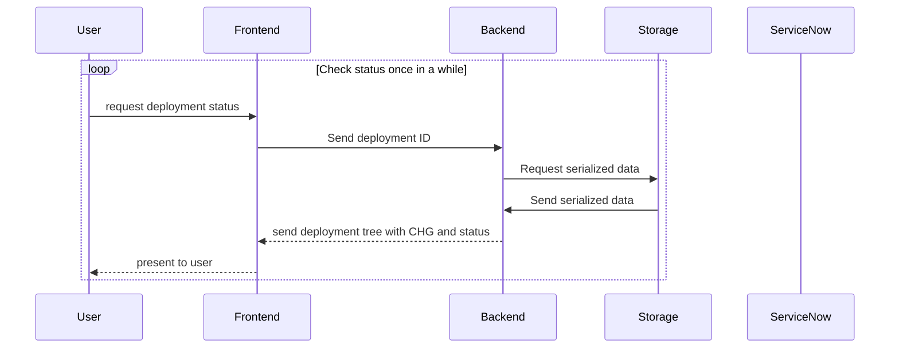

# system-design-deployment-tree
Visualize the deployment steps so it can be edited and human can manually intervened.

# The gist:
- The deployment order for each app looks like a B-tree - can be serialized - https://leetcode.com/problems/serialize-and-deserialize-n-ary-tree/
- The deployment order for the whole platform is an ordered forest - think of an array
- All of these can be stored in as an array of JSON dictionary, or serialized as below.

# Data example:
```json
["UninstallArtifact1,InstallArtifact2)UninstallArtifact3,InstallArtifact3))",
"UninstallArtifact1,UninstallArtifact3)InstallArtifact4)InstallArtifact2)"]
```




# System overview


### Deploy/Rollback Planning Flow

### Deploy/Rollback Apply Flow

### Checking Deployment Status



## Improvements:
- Convert/export to JSON option.

