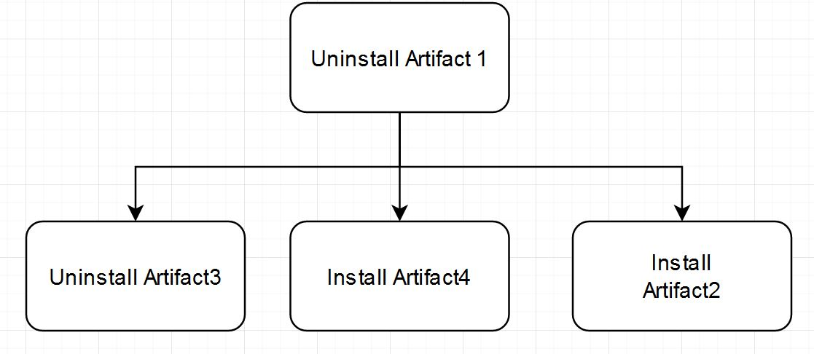

# system-design-deployment-tree
Organize deployment tree and store it locally so the business people can visualize it.

# The gist:
- The deployment order for each app looks like a B-tree - can be serialized - https://leetcode.com/problems/serialize-and-deserialize-n-ary-tree/
- The deployment order for the whole platform is an ordered forest - think of an array/json

# Data example:
```json
["UninstallArtifact1,InstallArtifact2)UninstallArtifact3,InstallArtifact3))",
"UninstallArtifact1,UninstallArtifact3)InstallArtifact4)InstallArtifact2)"]
```




## Design
1. Front-end:
a. Visualize tree
b. Allow user to edit it.
c. Serialize, deserialize tree to backend.
2. Back-end:
a. Serialize/deserialize tree
b. Keep track of deployment status
3. Database/storage:
a. Store the tree.


## Improvements:
- Convert/export to JSON option.