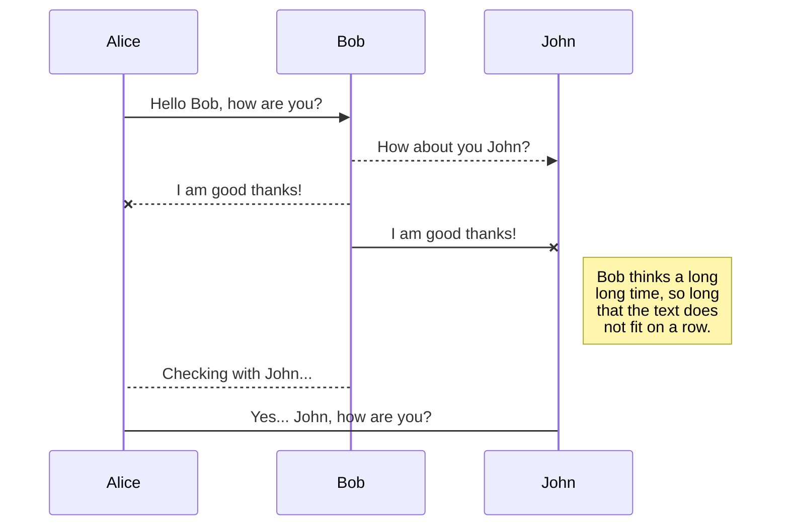

## UML diagrams

You can render UML diagrams using [Mermaid](https://mermaidjs.github.io/). For example, this will produce a sequence diagram:



# system-design-deployment-tree
Organize deployment tree and store it locally so the business people can visualize it.

# The gist:
- The deployment order for each app looks like a B-tree - can be serialized - https://leetcode.com/problems/serialize-and-deserialize-n-ary-tree/
- The deployment order for the whole platform is an ordered forest - think of an array/json

# Data example:
```json
["UninstallArtifact1,InstallArtifact2)UninstallArtifact3,InstallArtifact3))",
"UninstallArtifact1,UninstallArtifact3)InstallArtifact4)InstallArtifact2)"]
```


### Deploy/Rollback Planning Flow

### Deploy/Rollback Apply Flow

### Checking Deployment Status


## Improvements:
- Convert/export to JSON option.

